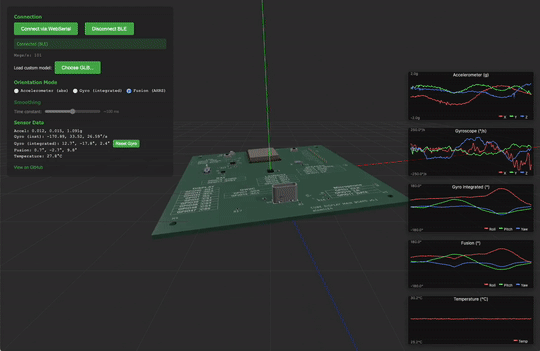

# Cube Display

This is a work in progress project.

I'm currently testing the first set of PCBs. There will be updates as I find issues!

You can see some of the testing so far on my YouTube channel: [atomic14](https://www.youtube.com/@atomic14).

The demo above is using the code from [here](https://github.com/atomic14/ESP32-LSM6DS3-Demo).

# Files

- display-board: 14 segment display board
- main-board: main board for the display-board
- main-board-tft: WIP - not complete.
